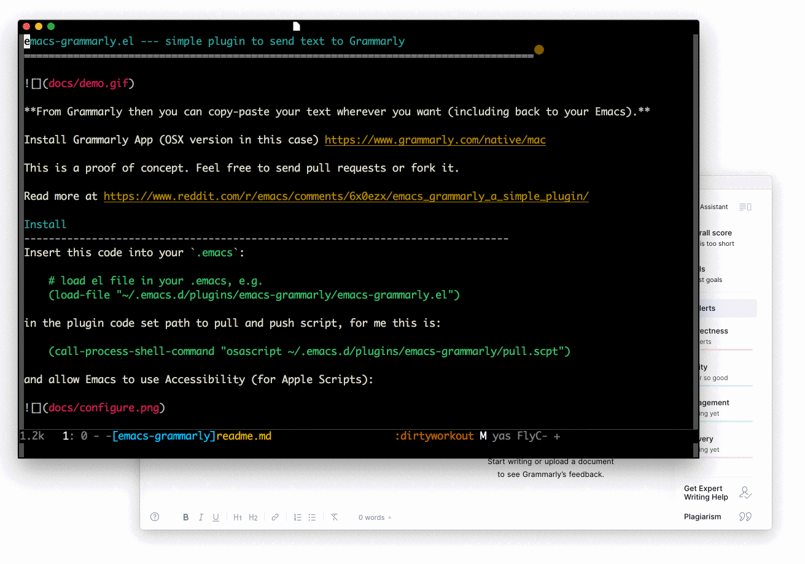
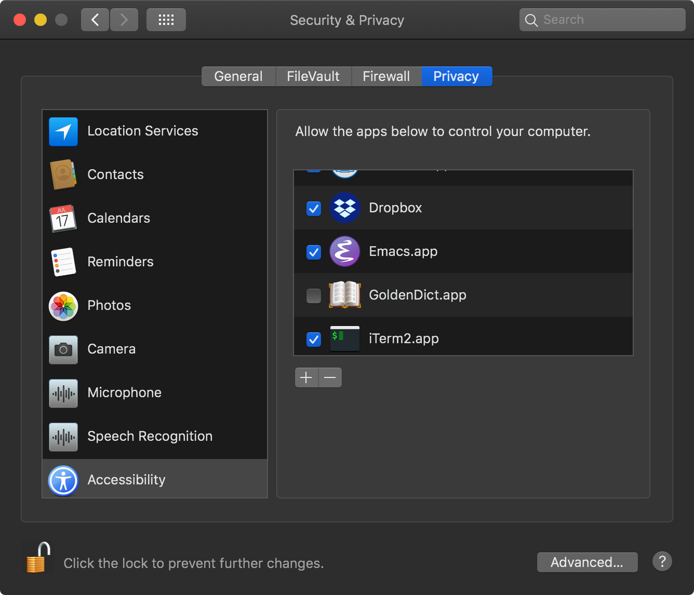

[](https://www.gnu.org/licenses/gpl-3.0)
[](https://jcs-emacs.github.io/jcs-elpa/#/send-to-osx-grammarly)

# send-to-osx-grammarly.el
> simple plugin to send text to/from Grammarly [OSX]

[](https://github.com/emacs-grammarly/send-to-osx-grammarly/actions/workflows/test.yml)



**Grammarly has to be opened and a new document has to be opened.**

Install Grammarly App (OSX version in this case) https://www.grammarly.com/native/mac

The plugin is using Apple Scripts, thus works only on macOS.

This is a proof of concept. Feel free to send pull requests or fork it.

Read more at https://www.reddit.com/r/emacs/comments/6x0ezx/emacs_grammarly_a_simple_plugin/

## Install

Insert this code into your `.emacs`:

```el
;; load el file in your .emacs, e.g.
(load-file "~/.emacs.d/plugins/send-to-osx-grammarly/send-to-osx-grammarly.el")
```

in the plugin code set path to pull and push script, for me this is:

```el
(call-process-shell-command "osascript ~/.emacs.d/plugins/send-to-osx-grammarly/pull.scpt")
```

and allow Emacs to use Accessibility (for Apple Scripts):



## Keybinding

You can bind key using the following snippets.

```el
(define-key global-map (kbd "C-c C-g h") #'send-to-osx-grammarly-push)
(define-key global-map (kbd "C-c C-g l") #'send-to-osx-grammarly-pull)
```

## Contribute

[](http://makeapullrequest.com)
[](https://github.com/bbatsov/emacs-lisp-style-guide)

If you would like to contribute to this project, you may either
clone and make pull requests to this repository. Or you can
clone the project and establish your own branch of this tool.
Any methods are welcome!
